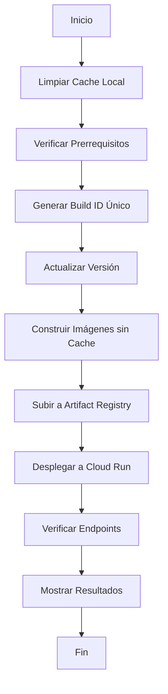

# 🚀 Scripts de Despliegue Robusto

## 📋 Descripción

Scripts mejorados para garantizar despliegues completos y robustos a Google Cloud, eliminando problemas de cache y asegurando que siempre se despliega la versión más reciente.

## 🛠️ Scripts Disponibles

### 1. `scripts/deploy-production.sh` (Principal)
**Script de despliegue robusto a producción**

**Características:**
- ✅ **Build ID único** con timestamp y commit hash
- ✅ **Sin cache** - regenera todas las imágenes desde cero
- ✅ **Limpieza previa** de contenedores y cache locales
- ✅ **Verificaciones completas** de prerrequisitos
- ✅ **Despliegue forzado** que garantiza actualización
- ✅ **Verificación automática** de endpoints
- ✅ **Información detallada** del despliegue

**Uso:**
```bash
./scripts/deploy-production.sh
```

### 2. `scripts/verify-deployment.sh` (Verificación)
**Script para verificar que el despliegue fue exitoso**

**Características:**
- ✅ **Verificación de servicios** en Cloud Run
- ✅ **Test de endpoints** (health, login, frontend)
- ✅ **Información de versiones** y builds
- ✅ **Estado de revisiones** e imágenes
- ✅ **URLs y configuración** actual

**Uso:**
```bash
./scripts/verify-deployment.sh
```

### 3. `scripts/cleanup-old-images.sh` (Limpieza)
**Script para limpiar imágenes antiguas de Artifact Registry**

**Características:**
- ✅ **Limpieza automática** de imágenes antiguas
- ✅ **Mantiene las últimas 5 imágenes** de cada servicio
- ✅ **Ahorro de espacio** en Artifact Registry
- ✅ **Reducción de costos** de almacenamiento

**Uso:**
```bash
./scripts/cleanup-old-images.sh
```

### 4. `scripts/update-version.sh` (Versión)
**Script para actualizar información de versión**

**Uso:**
```bash
./scripts/update-version.sh production
```

## 🔄 GitHub Actions

### `.github/workflows/deploy-google-cloud.yml`
**Workflow automático de despliegue**

**Características:**
- ✅ **Trigger automático** en push a `main`
- ✅ **Build ID único** para cada despliegue
- ✅ **Sin cache** - regeneración completa
- ✅ **Verificación automática** post-despliegue
- ✅ **Notificaciones detalladas** de éxito/error

## 🎯 Mejoras Implementadas

### ❌ Problemas Eliminados:
- **Cache de imágenes antiguas** - Ahora se regenera todo desde cero
- **Versiones no actualizadas** - Build ID único garantiza nuevas versiones
- **Contenedores no actualizados** - Despliegue forzado con `--no-cache`
- **Verificaciones insuficientes** - Tests completos de endpoints
- **Información limitada** - Logs detallados y verificación completa

### ✅ Garantías del Sistema:
1. **Regeneración completa** - `--no-cache` y `--pull` en builds
2. **Build ID único** - Timestamp + commit hash evita cache
3. **Limpieza previa** - Elimina contenedores y cache locales
4. **Verificación post-despliegue** - Tests automáticos de endpoints
5. **Información completa** - URLs, revisiones, imágenes, versiones

## 📊 Flujo de Despliegue



## 🚨 Solución de Problemas

### Si el despliegue falla:
1. **Ejecutar verificación:**
   ```bash
   ./scripts/verify-deployment.sh
   ```

2. **Ver logs de servicios:**
   ```bash
   gcloud run services logs read per-api --region=europe-west1
   gcloud run services logs read per-frontend --region=europe-west1
   ```

3. **Limpiar imágenes antiguas:**
   ```bash
   ./scripts/cleanup-old-images.sh
   ```

4. **Verificar permisos:**
   ```bash
   gcloud projects add-iam-policy-binding webpersonal-189221 \
     --member="serviceAccount:435987927843-compute@developer.gserviceaccount.com" \
     --role="roles/secretmanager.secretAccessor"
   ```

## 📝 Notas Importantes

- **Siempre usar `deploy-production.sh`** - Es el script principal robusto
- **Verificar con `verify-deployment.sh`** después de cada despliegue
- **Limpiar imágenes antiguas** periódicamente para ahorrar costos
- **Los Build IDs únicos** garantizan que no hay problemas de cache
- **El sistema regenera todo** desde cero en cada despliegue

## 🎉 Resultado

Con estos scripts mejorados, **nunca más tendrás problemas de cache o versiones antiguas**. Cada despliegue garantiza que se sube la versión más reciente y se regeneran todos los contenedores completamente.
